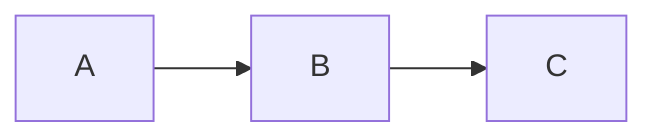
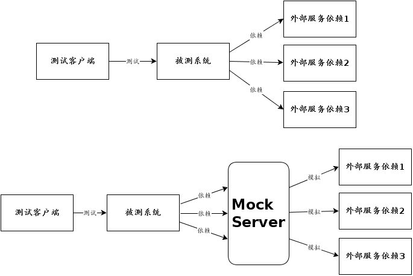

# 演进式接口自动化测试框架

[TOC]

## 从零搭建接口自动化测试脚手架

- 演进 0：纯脚本接口自动化测试
- 演进 1：提炼接口自动化通用类
- 演进 2：接口自动化通用类重构优化
- 演进 3：支持 RESTfull 风格的接口
- 演进 4：除了支持 Http 协议，新增支持陌生接口协议（例如 WebSocket 接口)
- 演进 5：测试数据分离与参数化（参数类）

## 单接口的测试

单接口测试的重点，其实就是保证该接口的正确性和健壮性，也就是说，你既要保证这个接口可以按照需求，正确处理传入的参数，给出正确的返回；也可以按照需求，正确的拒绝传入非正确的参数，给出正确的拒绝性返回。

示例：登录接口
参数是 username 和 password，这两个参数均不可以为空，也不可以超过 10 个字符；如果 username 和 password 这两个字符串相同，会登录成功并返回后续的说明性文本，否则，就会正确拒绝登录。
使用边界值方法设计的参数如下：

| id  | username      | password      | 预期结果                                                                                            |
| --- | ------------- | ------------- | --------------------------------------------------------------------------------------------------- |
| 1   | devin         | devin         | 正确进入系统，返回：please select One Equipment:\n10001:Knife\n10002:Big Sword\n10003:KuiHuaBaoDian |
| 2   | devin         | null          | 正确拒绝进入系统                                                                                    |
| 3   | null          | devin         | 正确拒绝进入系统                                                                                    |
| 4   | www.youmi.net | www.youmi.net | 正确拒绝进入系统                                                                                    |

## 业务流程接口测试

业务流程接口测试，主要是保障通过多个接口的串联操作可以完成原来需求中提出的业务逻辑，这也是它主要关注的内容：“进入系统后，选择武器，然后和你选择的敌人决斗。”

依据上面这种业务逻辑描述，对其做进一步的分析和细化，我们可以得到至少有下面这几个业务流程：

- 正确登录系统后，选择武器，与敌人决斗，杀死了敌人；
- 正确登录系统后，选择武器，与敌人决斗，被敌人杀死；
- 正确登录系统后，选择武器，与敌人决斗，两个人同归于尽；
- 正确登录系统，选择武器，没有选择敌人，自尽而死；
- 正确登录系统，选择一个未提供的武器编号，选择一个敌人，自尽而死；
- 正确登录系统，选择武器，选择一个未出战的敌人（不在返回提示列表中），自尽而死。

针对以上业务流程，我们的用例参数如下：
|id|username|password|equipmentid|enemyid|预期结果|
|---|---|---|---|---|---|
|1|devin|devin|10003|20001|正常完成业务流，显示杀死敌人赢得比赛相关信息|
|2|devin|devin|10001|20002|正常完成业务流，显示被敌人杀死相关信息|
|3|devin|devin|10001|20001|正常完成业务流，显示与敌人同归于尽相关信息|
|4|devin|devin|10001|null|正常完成业务流，显示自杀而死相关信息|
|5|devin|devin|10008|20001|正常完成业务流，显示自杀而死相关信息|
|6|devin|devin|10001|20008|正常完成业务流，显示自杀而死相关信息|

通过观察上面的业务流测试，你会发现和单接口的测试用例相比，少了很多异常状况，比如正确登录、正确选择装备参数等等，这一系的业务流中的反向用例都没有进行验证。
这就是业务接口测试和单接口测试的差异点。在单接口测试中，我们会完全覆盖全部异常状态；而在业务流程中，我们更需要关心业务流和数据流的关系，并不需要再过度关心如何用业务流的方法覆盖更多的代码逻辑异常，这也是分层测试中为什么在单元测试和界面测试之间要加入一层接口测试的主要原因之一。通过单接口测试，可以更加接近于单元测试；通过业务流的接口测试，可以更加接近于界面所承载的交互中的业务流验证。

## 微服务接口测试（复杂接口调用场景）

一般来说，开发工程师在开发前期就已经定义好了微服务接口，测试工程师和开发工程师几乎是同步开始进行各自的开发任务。但是，这种和谐的工作场景很快就被蜘蛛网一样的微服务调用关系给破坏了，几乎所有的项目都会出现相互依赖的关系，比如说服务 A 依赖服务 B，服务 B 依赖服务 C

- 当持续集成流水线部署服务 A 的时候，由于对应的开发工程师团队也在做同步改造，导致测试环境的服务 B 不可用；
- 由于服务 B 依赖服务 C，而服务 C 还没有开发完成，导致即使服务 A 和服务 B 都没问题，但也没有办法完成服务 A 的接口测试；

这就导致了虽然被测系统已经开发完成，测试脚本也准备就绪，但是测试工作就是没办法进行的悲惨结局。

如何面对这样的情形，我们该怎么办呢？解决方案就是是时候使用 Mock 服务，它能有效解决微服务间相互依赖而导致的混乱的系统调用关系！

#### 常见 Mock 场景

- 依赖部分未完成开发，暂不可用或不稳定；
- 依赖部分返回的内容不能满足测试需要；
- 依赖部分是第三方服务，无法掌控；
- 执行测试会产生负面的影响或脏数据；
- 测试时我们想要更快速、高效，更多的掌控和可视化；

#### 常见 Mock（TestDouble）方式

接口 Mock 服务是[TestDouble](http://xunitpatterns.com/Test%20Double.html)中的一种，TestDouble 通常分为五类：

- **Dummy(傀儡-单元测试）** objects are passed around but never actually used. Usually they are just used to fill parameter lists.
- **Fake（伪造-单元测试）** objects actually have working implementations, but usually take some shortcut which makes them not suitable for production (an InMemoryTestDatabase is a good example).
- **Stubs（插桩-单元测试）** provide canned answers to calls made during the test, usually not responding at all to anything outside what's programmed in for the test.
- **Spies（间谍-单元测试）** are stubs that also record some information based on how they were called. One form of this might be an email service that records how many messages it was sent.
- **Mocks(仿造-接口服务）** are pre-programmed with expectations which form a specification of the calls they are expected to receive. They can throw an exception if they receive a call they don't expect and are checked during verification to ensure they got all the calls they were expecting.

#### 常见 Mock 框架

| 语言     | Java               | Python         | 前端       |
| -------- | ------------------ | -------------- | ---------- |
| 内部依赖 | Mockito、PowerMock | unittest.mock  | mock.js    |
| 外部依赖 | MockServer         | mockito-python | Moco、模客 |

#### Mock 服务设计注意点

- **首先，简单是第一要素。** 无论原服务处理了多么复杂的业务流程，你在设计 Mock 服务时，只要关心原服务可以处理几种类型的参数组合，对应的服务都会返回什么样的参数就可以了。这样你就能快速抓住 Mock 服务的设计核心，也能快速完成 Mock 服务的开发。
- **其次，处理速度比完美的 Mock 服务更重要。** 一个 Mock 服务要能按照原服务正确又快速地返回参数，你不需要把大量的时间都浪费在 Mock 服务的调用上，它只是用来辅助你完成接口测试的一个手段。你需要让它像打在墙上的乒乓球一样，一触到墙面马上就反弹回来；而不能把球打出后，需要去喝个茶或者坐下休息一会，才能收到反弹回来的球。如果你的 Mock 服务很耗时，你在只有一个两个服务时，可能影响还不是很明显，但如果你同时有多个 Mock 服务，或者需要用 Mock 服务完成性能测试的时候，这就会变成一个很严重的问题，后续会引发强烈的“蝴蝶效应”，使得整个被测接口的响应速度越来越慢。因此你要建立一套快速的 Mock 服务，尽最大可能不让 Mock 服务占据系统的调用时间。
- **最后，你的 Mock 服务要能轻量化启动，并且容易销毁。** 你要时刻注意，Mock 服务只是一个辅助服务，因此，任何一个团队都不希望启动一个 Mock 服务需要等待 5 分钟，或者需要 100M 的内存。它要能快速启动、容易修改并且方便迁移。既然 Mock 服务的定位是轻量化的辅助服务，那么它也要容易销毁，以便你在完成测试后，可以快速且便捷地释放它所占据的资源。

## 接口测试思维

综上，接口测试时，我们要先从单个接口的测试开始，保障单个接口的正确性和健壮性，然后通过串联多个单个接口形成业务流，站在业务的角度完成各个业务逻辑的正确性检测，重点关注业务过程中数据的正确流转和对各个业务场景的覆盖。

## 参考资料

- [TestDouble](https://martinfowler.com/bliki/TestDouble.html)
- [Mocks Aren't Stubs](https://martinfowler.com/articles/mocksArentStubs.html)
- [MockServer](https://mock-server.com/)
- [美团 MockServer 实践](https://tech.meituan.com/2015/10/19/mock-server-in-action.html)
